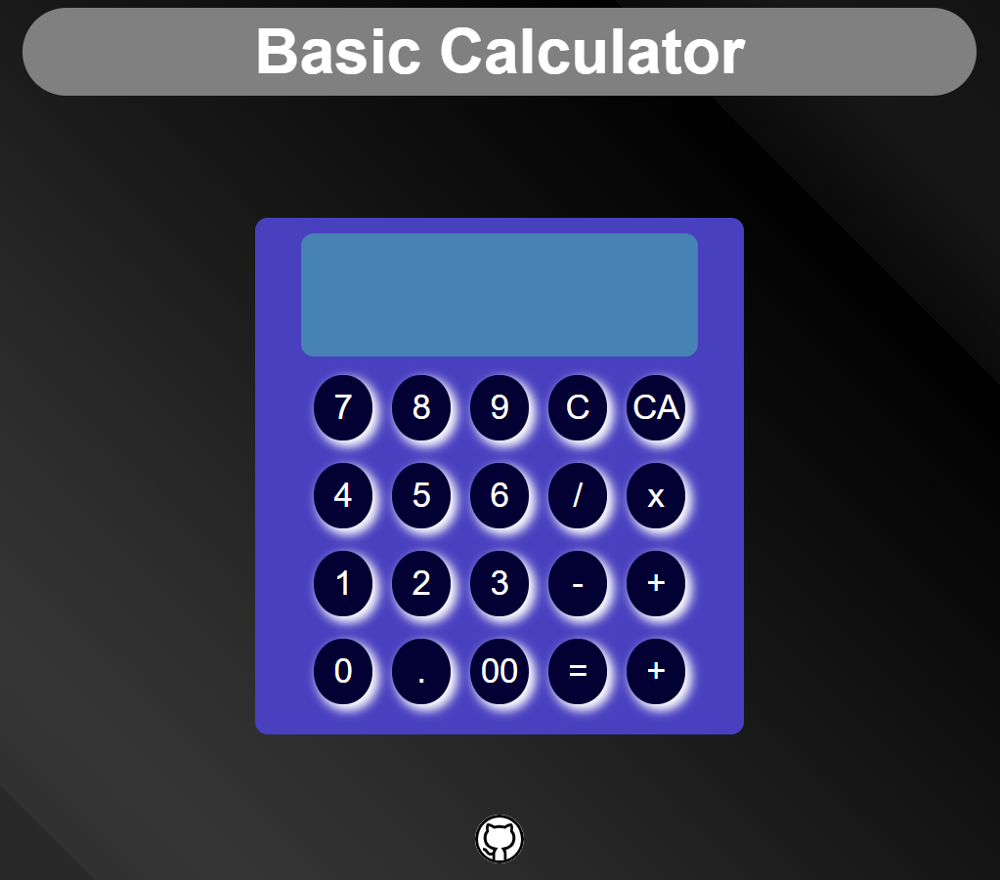

# Basic Calculator

> This is a basic calculator created as part of the odin project javascript course. It allows to make basic calculations. for instance, addition, multiplication, etc.

## :hammer: Built with:

- HTML5.
- UX.
- CSS3.
- Flexbox, Css grid.
- SCSS preprocessor.
- JavaScript.

## :red_circle: Live Demo:

[Live Demo Link](https://kcotrinam.github.io/calculator/)

## :construction_worker: Getting Started

To get a local copy up and running follow these simple steps:

- Go to the main page.
- Press the "Code" button and get the repo link.
- Clone it using git command "git clone &lt;link>".

## :bust_in_silhouette: Author

👤 **Kevin Cotrina**

- Github: [@githubhandle](https://github.com/kcotrinam92)
- Twitter: [@twitterhandle](https://twitter.com/KevinCot12)
- Linkedin: [linkedin](https://www.linkedin.com/in/kevin-cotrina-6208b7149/)

## 🤝 :raised_hand: :raised_hand: Contributions

Contributions, issues and feature requests are welcome!

Feel free to check the [issues page](https://github.com/kcotrinam/calculator/issues).

## Show your support

Give a :star: if you like this project!.

## :grey_exclamation: Acknowlegment

- To [TheOdinProject](https://www.theodinproject.com/dashboard)
- Stand up team

## 📝 License

This project is [MIT](./LICENSE) licensed.
